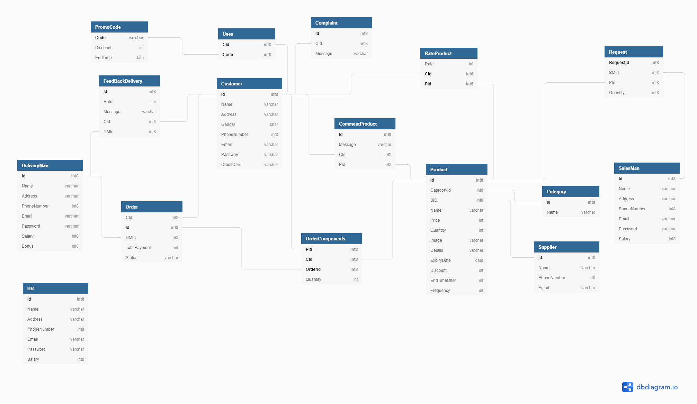

# Online-Shopping-Store
## About
This is the database schema, ER diagram and SQL script for an online shopping store application. The application simulates a complete online shopping system, starting from the customer that can shop and buy products, the sales man that can add, delete products, the delivery man that confirms and deliver ordered products to dedicated locations, to the HR of the online shopping system who monitors the performance of the employees (delivery men) and their customer's ratings, as well as feedback emails from customers.

There are 4 main roles:
1. Customer
2. Sales Man
3. Human Resource (HR)
4. Delivery man
 
Each role has its own application view, and functionalities.

## System Schema

## ER Diagram

